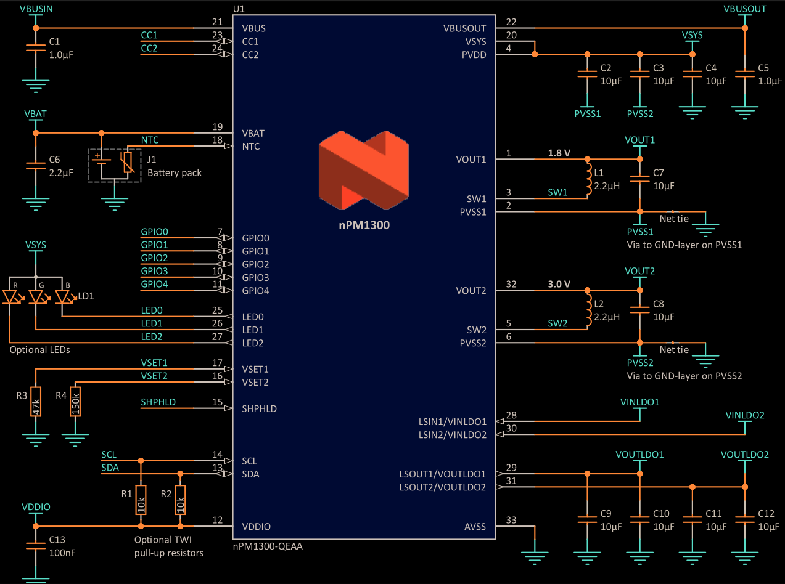
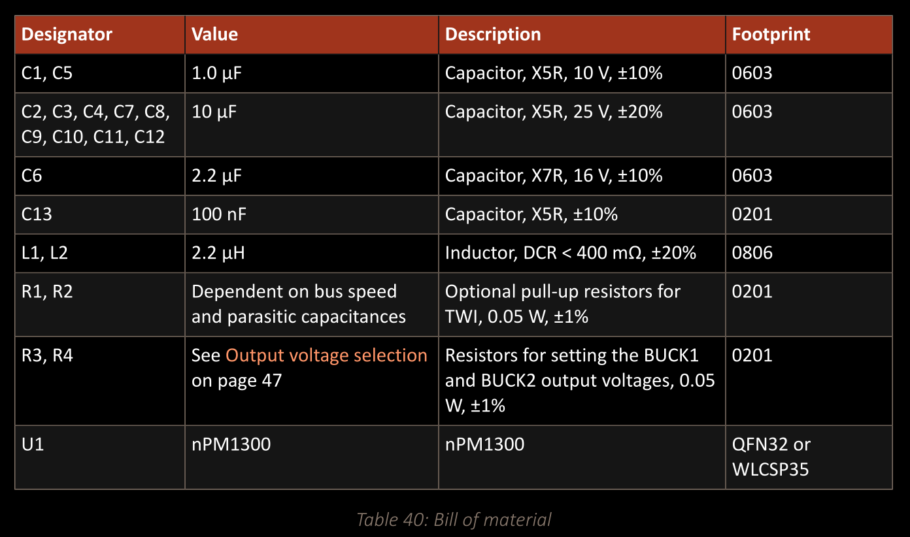
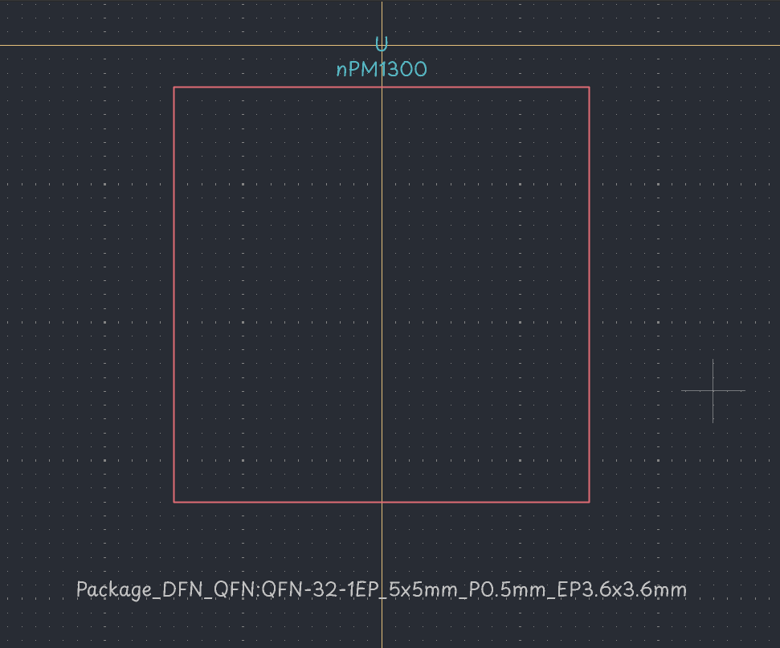
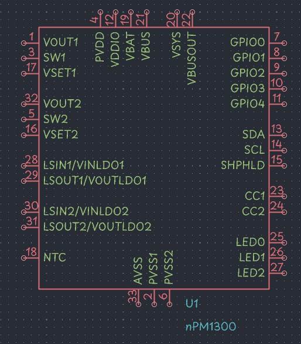
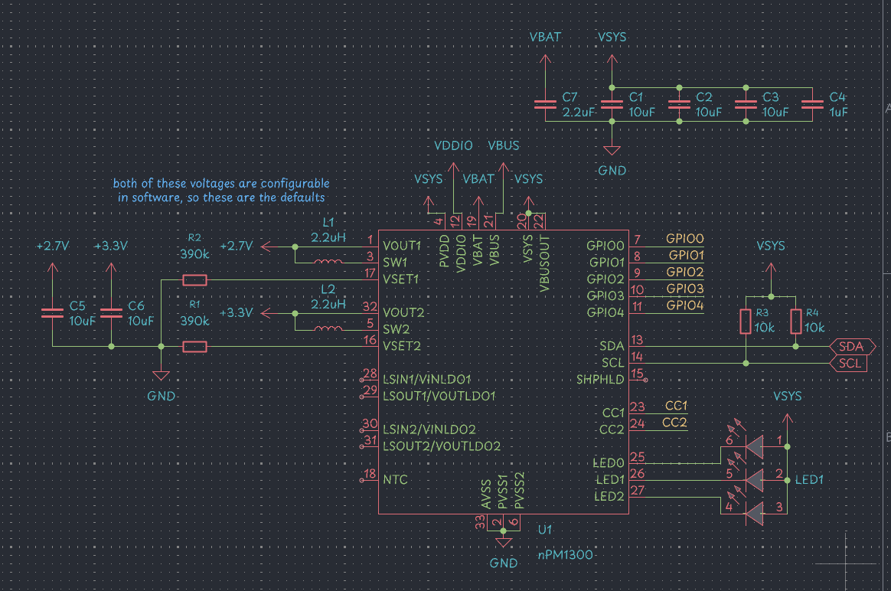

# Jun 21, 2025 | 22:50 - 00:10 | getting started

Found the datasheet for the microcontroller here: [https://docs.nordicsemi.com/bundle/ps_nrf52840/page/keyfeatures_html5.html](https://docs.nordicsemi.com/bundle/ps_nrf52840/page/keyfeatures_html5.html)

PMIC datasheet: [https://docs.nordicsemi.com/bundle/ps_npm1300/page/keyfeatures_html5.html](https://docs.nordicsemi.com/bundle/ps_npm1300/page/keyfeatures_html5.html)

Time to go shopping on LCSC (and Digikey for some unavailable parts):

- USB C Receptacle: [https://lcsc.com/product-detail/image/GT-USB-7010ASV_C2988369.html](https://lcsc.com/product-detail/image/GT-USB-7010ASV_C2988369.html)
- nRF52840 chip: [https://www.digikey.ca/en/products/detail/nordic-semiconductor-asa/NRF52840-QFAA-F-R7/15929801](https://www.digikey.ca/en/products/detail/nordic-semiconductor-asa/NRF52840-QFAA-F-R7/15929801)
- nPM1300 chip: [https://www.digikey.ca/en/products/detail/nordic-semiconductor-asa/NPM1300-QEAA-R/19722479](https://www.digikey.ca/en/products/detail/nordic-semiconductor-asa/NPM1300-QEAA-R/19722479)
- 2.2uH inductor: [https://lcsc.com/product-detail/image/ZEMS252012T2R2M_C42462928.html](https://lcsc.com/product-detail/image/ZEMS252012T2R2M_C42462928.html)

# Jun 22, 2025 | 12:32 - 13:32 | making a pseudo BOM, mostly important parts

Basing from this reference schematic from the nPM1300 datasheet:

Their suggested BOM:

Already picked the inductor yesterday, so let's finish picking the resistors and capacitors.

- 10V 1uF X5R ±10% 0402: [https://lcsc.com/product-detail/Multilayer-Ceramic-Capacitors-MLCC-SMD-SMT_HRE-CGA0402X5R105K100GT_C7503520.html](https://lcsc.com/product-detail/Multilayer-Ceramic-Capacitors-MLCC-SMD-SMT_HRE-CGA0402X5R105K100GT_C7503520.html)
- 25V 10uF X5R ±10% 0805: [https://lcsc.com/product-detail/Multilayer-Ceramic-Capacitors-MLCC-SMD-SMT_Samsung-Electro-Mechanics-CL21A106KAYNNNE_C15850.html](https://lcsc.com/product-detail/Multilayer-Ceramic-Capacitors-MLCC-SMD-SMT_Samsung-Electro-Mechanics-CL21A106KAYNNNE_C15850.html)
- 25V 2.2uF X7R ±10% 0805: [https://www.lcsc.com/product-detail/Multilayer-Ceramic-Capacitors-MLCC-SMD-SMT_Samsung-Electro-Mechanics-CL21B225KAFNNNE_C19110.html](https://www.lcsc.com/product-detail/Multilayer-Ceramic-Capacitors-MLCC-SMD-SMT_Samsung-Electro-Mechanics-CL21B225KAFNNNE_C19110.html)
- 16V 100nF X7R ±10% 0402: [https://www.lcsc.com/product-detail/Multilayer-Ceramic-Capacitors-MLCC-SMD-SMT_YAGEO-CC0402KRX7R7BB104_C60474.html](https://www.lcsc.com/product-detail/Multilayer-Ceramic-Capacitors-MLCC-SMD-SMT_YAGEO-CC0402KRX7R7BB104_C60474.html)
- 62.5mW Thick Film Resistor 50V ±100ppm/℃ ±1% 10kΩ 0402 for TWI pull ups: [https://www.lcsc.com/product-detail/Chip-Resistor-Surface-Mount_YAGEO-RC0402FR-0710KL_C60490.html](https://www.lcsc.com/product-detail/Chip-Resistor-Surface-Mount_YAGEO-RC0402FR-0710KL_C60490.html)
- 62.5mW Thick Film Resistor 50V ±100ppm/℃ ±5% 390kΩ 0402 for initial voltage selection: [https://lcsc.com/product-detail/Chip-Resistor-Surface-Mount_FH-Guangdong-Fenghua-Advanced-Tech-RC-02K394JT_C453676.html](https://lcsc.com/product-detail/Chip-Resistor-Surface-Mount_FH-Guangdong-Fenghua-Advanced-Tech-RC-02K394JT_C453676.html)

Let's wire the schematic for the PMIC!

Since there isn't a symbol for the nPM1300, I guess I will create my own.

# Jun 24, 2025 | 12:30 - 16:30 | finished making nPM1300 symbol and wiring

finally done :pff:

since we have 3 led channel, we can use a single RGB LED to get different colors: [https://lcsc.com/product-detail/RGB-LEDs_TCWIN-TC5050RGBF08-3CJH-AF53A_C784540.html](https://lcsc.com/product-detail/RGB-LEDs_TCWIN-TC5050RGBF08-3CJH-AF53A_C784540.html)

finished wiring the PMIC yay! lets start wiring up the MCU.

